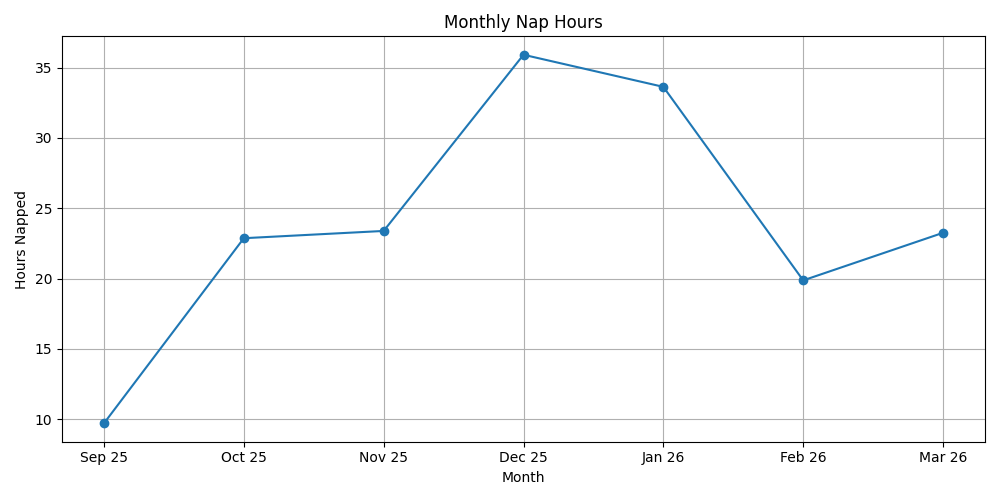

# tadpoles-data

Python program to programatically login to tadpoles (childcare app), pull events, and calculate hours napped by month then chart using matplotlib.



## Setup

1. Create an `.env` file in project root
2. Add username/password

```sh
EMAIL="your_tadpoles_account_email@gmail.com"
PASSWORD="your_tadpoles_password"
```

3. Install local deps
4. Invoke `main.py` with args

```sh
python main.py -m 9 -y 2025
```

Example above will graph monthly nap hours up to current date.

**Required flags**

`-m` Start month

`-y` Start year
